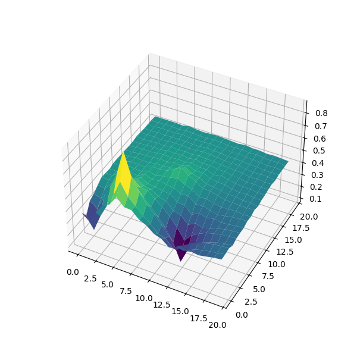
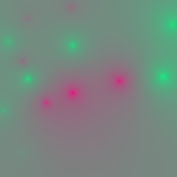

# Descripción del Algoritmo

El algoritmo se ejecuta en un espacio bidimensional, donde se posicionan varios puntos principales. Estos puntos deben cumplir con dos condiciones: deben ser al menos dos puntos y tener valores diferentes; de lo contrario, la malla estaría completamente del mismo color. La matriz puede tener cualquier tamaño, y la cantidad de puntos principales, así como sus valores en el rango [0, 1], pueden ser ajustados según se desee.

## Funcionamiento del algoritmo

1. **Cálculo de los valores de las casillas**  
   El algoritmo calcula el valor de todas las casillas que no son puntos principales, utilizando una fórmula matemática. La fórmula asigna el valor de cada casilla como la suma de los valores de los puntos principales multiplicados por su respectivo grado de influencia.

2. **Grado de influencia**  
   La suma de todos los grados de influencia debe ser igual a 1, ya que corresponde a un porcentaje.

   El grado de influencia de un punto principal sobre una casilla se calcula de la siguiente manera:
   1. Se obtiene la distancia entre el punto principal y la casilla.
   2. La distancia se invierte, de modo que los puntos más cercanos tengan una mayor influencia.
   3. El valor de influencia de un punto principal se calcula dividiendo la distancia invertida entre la suma total de las distancias invertidas de todos los puntos principales.

   **Fórmulas:**
   - Distancia invertida:  
     `distanciaInvertida = (1 / distancia1)`
   
   - Distancia invertida total:  
     `distanciaInvertidaTotal = distanciaInvertida1 + distanciaInvertida2 + ...`
   
   - Valor de una casilla:  
     `Valor de x casilla = valorCasillaPrincipal1 * (distanciaInvertida1 / distanciaInvertidaTotal) + valorCasillaPrincipal2 * (distanciaInvertida2 / distanciaInvertidaTotal) + ...`

   El valor final de la casilla es una combinación ponderada de las influencias de todos los puntos principales, considerando su distancia a la casilla en cuestión. De este modo, las casillas dependen de la distancia a los puntos principales, y su valor refleja la influencia de dichos puntos según la fórmula descrita.

## Asignación de puntos principales

La asignación de los puntos principales es clave. Estos puntos pueden ser asignados manualmente o mediante un sistema automatizado. En este caso, se utiliza un sistema basado en semillas, donde a partir de un número dado, se calcula cuántos puntos añadir, así como sus valores y posiciones.

## Generación del mapa de calor

El código genera un mapa de calor en formato `.ppm`, lo que permite visualizar los resultados de forma clara. Además, gracias al script Python `Viewer3D.py`, es posible generar la representación 3D de la imagen `.ppm` (por ejemplo, `MapaDeCalor.ppm`).

## Ejemplos

El algoritmo funciona de manera más eficiente en cuadrículas de pequeño tamaño. Algunos ejemplos de la representación 3D generada en cuadrículas de tamaño 100x100 y 20x20:

 

Se observa que el algoritmo es más fluido en estos casos en comparación con los generados aleatoriamente:

 

Así se ven los mapas de calor:

 
