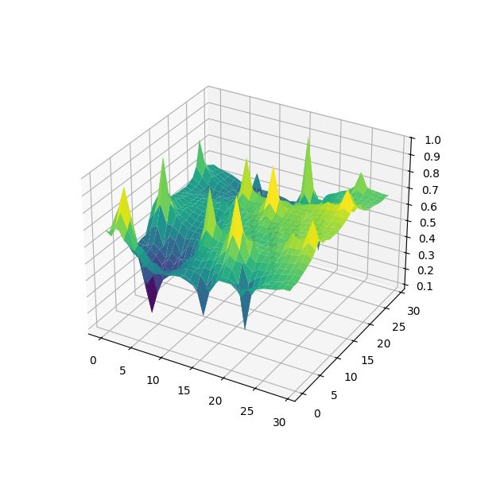
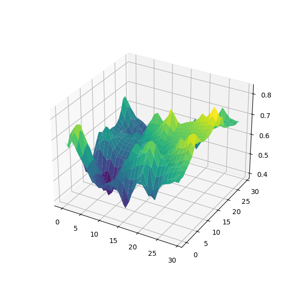

# Descripción del Algoritmo

El algoritmo se ejecuta en un espacio bidimensional, donde se posicionan varios puntos principales. Estos puntos deben cumplir con dos condiciones: deben ser al menos dos puntos y tener valores diferentes; de lo contrario, la malla estaría completamente del mismo color. La matriz puede tener cualquier tamaño, y la cantidad de puntos principales, así como sus valores en el rango [0, 1], pueden ser ajustados según se desee.

## Funcionamiento del algoritmo

1. **Cálculo de los valores de las casillas**  
   El algoritmo calcula el valor de todas las casillas que no son puntos principales, utilizando una fórmula matemática. La fórmula asigna el valor de cada casilla como la suma de los valores de los puntos principales multiplicados por su respectivo grado de influencia.

2. **Grado de influencia**  
   La suma de todos los grados de influencia debe ser igual a 1, ya que corresponde a un porcentaje.

   El grado de influencia de un punto principal sobre una casilla se calcula de la siguiente manera:
   1. Se obtiene la distancia entre el punto principal y la casilla.
   2. La distancia se invierte, de modo que los puntos más cercanos tengan una mayor influencia.
   3. El valor de influencia de un punto principal se calcula dividiendo la distancia invertida entre la suma total de las distancias invertidas de todos los puntos principales.

   **Fórmulas:**
   - Distancia invertida:  
     `distanciaInvertida = (1 / distancia1)`
   
   - Distancia invertida total:  
     `distanciaInvertidaTotal = distanciaInvertida1 + distanciaInvertida2 + ...`
   
   - Valor de una casilla:  
     `Valor de x casilla = valorCasillaPrincipal1 * (distanciaInvertida1 / distanciaInvertidaTotal) + valorCasillaPrincipal2 * (distanciaInvertida2 / distanciaInvertidaTotal) + ...`

   El valor final de la casilla es una combinación ponderada de las influencias de todos los puntos principales, considerando su distancia a la casilla en cuestión. De este modo, las casillas dependen de la distancia a los puntos principales, y su valor refleja la influencia de dichos puntos según la fórmula descrita.

## Asignación de puntos principales

La asignación de los puntos principales es clave. Estos puntos pueden ser asignados manualmente o mediante un sistema automatizado. En este caso, se utiliza un sistema basado en semillas, donde a partir de un número dado, se calcula cuántos puntos añadir, así como sus valores y posiciones.

Esto se consigue gracias a una función que, dada una semilla, a través de una serie de operaciones y productos modulares, se obtiene otro número pseudoaleatorio.

## Generación del mapa de calor

El código genera un mapa de calor en formato `.ppm`, lo que permite visualizar los resultados de forma clara. Además, gracias al script Python `Viewer3D.py`, es posible generar la representación 3D de la imagen `.ppm` (por ejemplo, `MapaDeCalor.ppm`).

## Generación de mapa 3D

Es un script con Python que, gracias a librerías como Matplotlib, crea una representación 3D del mapa de calor de la imagen .ppm, en los ejemplos se observa.

# Generador de Mapas

Este proyecto permite generar mapas utilizando funciones personalizables que aplican algoritmos basados en números pseudoaleatorios.

## Funciones Principales

### 1. `CrearUnaCasillaRandom`
Esta función genera una casilla con valores aleatorios según una semilla. Permite configurar los siguientes parámetros:

```plaintext
- ancho: Número de píxeles por casilla horizontalmente.
- alto: Número de píxeles por casilla verticalmente.
- seed: Semilla pseudoaleatoria utilizada para generar los números aleatorios.
- MaximoPuntosPrincipales: Número máximo de puntos principales (mínimo 2).
```

#### Funcionamiento
A partir de la semilla (`seed`), se genera una secuencia de números pseudoaleatorios para determinar cuántos puntos principales hay. Se asigna a cada uno un valor entre `[0,1]` y se colocan aleatoriamente en la casilla. Posteriormente, se aplica el algoritmo de generación y se devuelve la matriz resultante.

---

### 2. `CreaUnaCasillaPersonalizada`
Esta función permite personalizar la ubicación y el valor de los puntos principales dentro de la casilla. Sus parámetros son:

```plaintext
- ancho: Número de píxeles por casilla horizontalmente.
- alto: Número de píxeles por casilla verticalmente.
- seed: Semilla pseudoaleatoria para la generación de números aleatorios.
```

#### Funcionamiento
Es similar a `CrearUnaCasillaRandom`, pero dentro del código se permite especificar manualmente la cantidad, posición y valor de los puntos principales. Esto facilita la experimentación y la creación de patrones específicos.

---

### 3. `CrearMapaRandom`
Esta función genera un mapa completo compuesto por múltiples casillas, asegurando continuidad entre ellas. Parámetros configurables:

```plaintext
- NumeroInfluenciaCasillasLaterales: Controla cuántos valores se heredan de casillas anteriores para garantizar continuidad.
- casillasHorizon: Número de casillas en sentido horizontal.
- casillasVertical: Número de casillas en sentido vertical.
- anchoCasilla: Ancho de cada casilla en píxeles.
- altoCasilla: Alto de cada casilla en píxeles.
- seed: Semilla inicial para la generación de números pseudoaleatorios.
- PuntosPrinciMax: Máximo de puntos principales sin contar los añadidos para continuidad.
```

#### Funcionamiento
Cada casilla se genera como en `CrearUnaCasillaRandom`, pero además, se añaden puntos de las casillas adyacentes según el parámetro `NumeroInfluenciaCasillasLaterales`. Cuanto menor sea este valor, más puntos se heredan de casillas contiguas, mejorando la continuidad del mapa. 

El proceso se repite hasta completar la matriz final.

---

## Filtro de Suavizado: `filtroReducirPorDiferencias`
Dado que el algoritmo puede generar picos muy pronunciados, se aplica un filtro para suavizarlos. Se pueden configurar los siguientes parámetros:

```plaintext
- factorReductor: Controla cuánto peso tiene el valor original en el cálculo del nuevo valor (a mayor valor, más importancia tiene el pico original).
- diffMax: Diferencia máxima a partir de la cual se aplica el filtro.
- vueltasDeSuavizado: Número máximo de iteraciones de suavizado.
```

### Funcionamiento
1. Se calcula el valor promedio (`avg`) de las casillas adyacentes.
2. Si la diferencia entre el valor de la casilla y `avg` supera `diffMax`, se ajusta el valor siguiendo la fórmula:
   
   ```plaintext
   Valor = (avg + valorDeLaCasilla * factorReductor) / (factorReductor + 1)
   ```
3. Este proceso se repite hasta el número de iteraciones indicado en `vueltasDeSuavizado`.

Este filtro permite reducir y normalizar los picos, tanto positivos como negativos, obteniendo un mapa más uniforme y realista.

# Ejemplos
A continuación, se presentan ejemplos de configuración y resultados obtenidos con este sistema. Se incluyen:

- **Configuración utilizada**: Se detallan los parámetros aplicados para generar los mapas.
- **Mapas de calor**: Se muestran dos imágenes, una con el mapa original y otra con el resultado tras aplicar el filtro de suavizado.
- **Representaciones en 3D**: Se presentan dos imágenes en 3D, donde la izquierda muestra el mapa sin filtro y la derecha el resultado filtrado.

Estos ejemplos permiten visualizar las diferencias entre las configuraciones aplicadas y muestran posibles usos del sistema en la generación de terrenos o estructuras visuales.

### Terreno Montañoso Normal

Se ha utilizado `crearMapaRandom` con los siguientes parámetros:

- **Número de Influencia de Casillas Laterales:** 3  
- **Casillas Horizontales:** 3  
- **Casillas Verticales:** 3  
- **Ancho de Casilla:** 10  
- **Alto de Casilla:** 10  
- **Seed:** 86756767  
- **Puntos Principales Máximos:** 4  

#### Parámetros del Filtro  
- **Factor Reductor:** 2  
- **Diferencia Máxima:** 0.05  
- **Vueltas de Suavizado:** 1000

 
 


